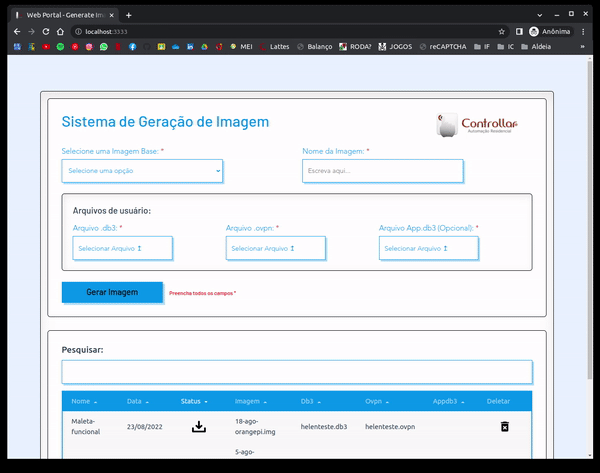

<hr>

# Sdcard Web

This template should help get you started developing with Vue 3 in Vite.

## Configure

- A plataforma foi desenvolvida com o Node versao 16.16.0 e Instalado com ``` nvm ```

```nvm``` e um gerenciador de versao do node e para instala-lo basta seguir o passo a passo <a href="https://github.com/nvm-sh/nvm">clicando aqui</a>

Apos instalar o nvm, basta instalar a versao 16.16.0 do node com o seguinte comando:

```
nvm install 16.16.0 && nvm use 16.16.0
```

Voce pode verificar se a versao esta correta rodando:

```
node --version 
```
## Project Setup
Para rodar o projeto, primeiro deve-se baixar as dependencias com o seguinte comando:

```sh
npm install
```

### BackEnd Execute with FrontEnd
Para executar o projeto completo:

```sh
npm run build && npm run dev-server
```
lets to http://localhost:(port on cfg.json)
<br>
user:(especificar no cfg.json)
<br>
password:(especificar no cfg.json)

### FrontEnd Execute Only
Para executar apenas o FrontEnd da Aplicacao:

```sh
npm run dev-front
```

### BackEnd Execute Only
Para executar apenas o BackEnd da Aplicacao (projeto deve estar buildado):

```sh
npm run dev-server
```


### install expect on server
Para rodar o script de criacao de imagem, deve-se ter o expect instalado:
```
sudo apt install expect
```


### Copy Image Bases

Copiar imagens base para a pasta public/base-images

### Create and configure cfg.json

Para rodar o projeto, deve-se configurar algumas coisas:

- criar o arquivo cfg.json na raiz do projeto
- configura-lo:

```json
{
    "port": Number,
    "bind": String,
    "servers": [],
    "username": String,
    "password": String,
    "web": {
        "dateFormat": "HH:mm:ss - DD.MM.YY"
    },
    "offset_orangepi" : Number,
    "offset_raspberrypi": Number,
    "root_password": String,
    "protocol": "http"
}

```
Sendo:
<br>
<br>
port: porta do servidor
<br>
bind: dominio do servidor
<br>
username: usuario de acesso a plataforma
<br>
password: senha de acesso a plataforma
<br>
dateFormat: Formato da data e hora da plataforma
<br>
offset_orangepi: ```fdisk -l nomedaimagemdaorangepi.img``` verificar o numero na coluna "Inicio" e multiplicar por 512
<br>
offset_raspberrypi: ```fdisk -l nomedaimagemdaraspberrypi.img``` verificar o numero na coluna "Inicio" e multiplicar por 512
<br>
root_password: senha de root do servidor
<br>
protocol: protocolo (http ou https)
